<div align="center">

# 📡 Basys 3 고신뢰성 이중화 통신 : RS-422 기반 채널 자동 절체 시스템

### RS-422-Based Automatic Channel Failover System

<br>


<br>


<br><br>

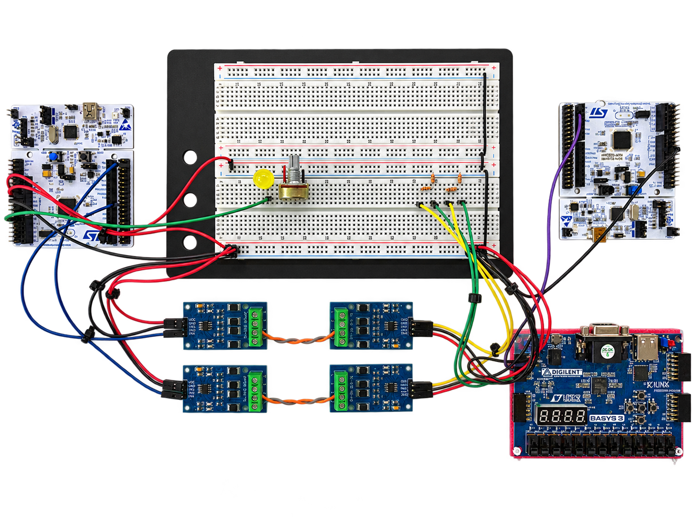

</div>

<br>

두 개의 독립된 UART/RS-422 수신 경로에서 동일한 명령 프레임을 받아, 무결성과 채널 상태를 검사한 뒤 하나의 출력으로 전달하는 Basys 3 기반 통신 게이트웨이입니다. 한 채널에 오류나 누락이 발생하면 사용 가능한 채널로 전송을 이어가고, 서로 다른 내용의 프레임은 임의로 선택하지 않고 차단합니다.

프레임 수신·판정·중복 제거·출력 변환은 공통 RTL 코어가 처리합니다. MicroBlaze V는 AXI4-Lite를 통해 동작 임계값과 명령 매핑을 설정하고, 이벤트 FIFO 및 인터럽트로 장애 원인을 조회합니다.

> 대상 FPGA는 Xilinx Artix-7 `xc7a35tcpg236-1`입니다. Block Design에는 RISC-V 기반 `microblaze_riscv:1.0` IP가 사용되며, 통신 코어의 기준 클럭은 100 MHz입니다.

<br>

## 0. 목차

1. [동작 시나리오](#1-동작-시나리오)
2. [핵심 기술 요약](#2-핵심-기술-요약)
3. [프로젝트 개요](#3-프로젝트-개요)
4. [주요 기능](#4-주요-기능)
5. [시스템 구성](#5-시스템-구성)
6. [아키텍처](#6-아키텍처)
7. [프레임과 이벤트 데이터](#7-프레임과-이벤트-데이터)
8. [AXI4-Lite 인터페이스](#8-axi4-lite-인터페이스)
9. [핀맵과 상태 표시](#9-핀맵과-상태-표시)
10. [장애 판정과 상태 전이](#10-장애-판정과-상태-전이)
11. [실행 구조와 소스 구성](#11-실행-구조와-소스-구성)
12. [핵심 설계 포인트](#12-핵심-설계-포인트)
13. [Troubleshooting](#13-troubleshooting)
14. [검증 및 성능 분석](#14-검증-및-성능-분석)
15. [빌드와 소프트웨어 연동](#15-빌드와-소프트웨어-연동)

<br>

## 1. 동작 시나리오

| 상황 | 입력과 판정 | 출력 |
|---|---|---|
| 정상 이중 수신 | 같은 sequence와 같은 내용의 A/B 프레임 | 우선 채널의 프레임을 한 번 전달 |
| 채널 누락 | pair 대기 시간 안에 한 채널만 수신 | 사용 가능한 단일 채널을 채택 |
| CRC 오류 | 손상된 프레임 검출, 채널별 실패 이벤트 반영 | 정상 경로를 통한 전달 여부 판정 |
| 내용 불일치 | 같은 pair의 내용이 다름 | 프레임 폐기 및 mismatch 이벤트 |
| 지연 중복 | 이미 출력한 ID·sequence의 프레임 재도착 | 중복 출력 차단 |
| 채널 복구 | 정상 일치 pair를 복구 임계값까지 누적 | 해당 채널의 Fault 해제 |
| 양쪽 사용 불가 | 사용 가능한 채널 없음 | 출력 차단 및 상태 기록 |

설정과 관측은 CPU가 담당하지만 프레임 처리와 상태 표시는 RTL에서 진행됩니다. 장애 분석은 LED/FND와 AXI 이벤트 레코드를 통해 수행합니다.

<br>

## 2. 핵심 기술 요약

| 분류 | 핵심 기술 |
|---|---|
| 수신 | 독립 UART RX A/B, 기본 115,200 baud |
| 무결성 | CRC-16/CCITT-FALSE, 길이 검사, sequence 검사 |
| 이중화 | Frame FIFO, pair matching, 단일 채널 fallback |
| 장애 관리 | 실패 이벤트 누적, 채널 timeout, 정상 pair 기반 복구 |
| 출력 | 중복 제거, 장치 ID·명령 변환, CRC 재계산, UART TX |
| 버퍼 | 프레임·이벤트 버퍼, valid/ready 흐름 제어 |
| 관리 | 32-bit AXI4-Lite, byte strobe, W1C/W1P |
| 진단 | 64-bit timestamped event, 이벤트 중재, FIFO, IRQ |
| CPU | MicroBlaze V, 64 KiB LMB local memory |
| 표시 | LED heartbeat/alert, 4자리 7-Segment |
| 디버그 | RISC-V MDM, System ILA, AXI UART Lite |
| 검증 | Verilog-2005 테스트벤치, 코어 OOC 합성·배치·배선 |

<br>

## 3. 프로젝트 개요

| 항목 | 내용 |
|---|---|
| 프로젝트명 | Project04_RS422Failover |
| 대상 보드 | Digilent Basys 3 |
| FPGA | Artix-7 XC7A35T, CPG236, speed grade -1 |
| 목적 | 이중 수신 경로의 장애 감지와 정상 프레임 전달 |
| 입력 | UART 논리 레벨 수신 2채널 |
| 출력 | 선택·변환된 UART 프레임 1채널 |
| 기준 클럭 | 100 MHz |
| 기본 통신 속도 | 115,200 baud |
| 사용자 payload | 0~16 bytes |
| 설정 경로 | MicroBlaze V → AXI SmartConnect → Custom IP |
| 개발 도구 | Vivado 2024.2 |

RS-422는 외부 트랜시버의 차동 물리 계층이고, FPGA의 `rs422_rx_a/b`와 `rs422_tx_out`은 3.3 V 단일 종단 UART 논리 신호입니다.

<br>

## 4. 주요 기능

- **이중 수신** : A/B 채널을 독립적으로 수신하고 프레임을 조립합니다.
- **프레임 검증** : 길이·CRC·sequence와 수신 timeout을 검사합니다.
- **Pair matching** : 두 채널의 프레임을 맞춰 일치 여부와 누락을 구분합니다.
- **채널 장애 관리** : 실패 누적과 정상 pair 누적으로 Fault/복구를 판정합니다.
- **출력 선택** : pair 일치, 단일 수신, 사용 가능 채널을 종합해 채택 여부를 결정합니다.
- **중복 차단** : 최근 출력 이력의 장치 ID와 sequence를 비교합니다.
- **프로토콜 변환** : 출력 장치 ID와 명령을 매핑하고 CRC를 다시 계산합니다.
- **이벤트 추적** : 발생 시각·코드·채널·sequence·상세 정보를 기록합니다.
- **AXI 관리** : 임계값, timeout, 명령 매핑, IRQ, 이벤트 POP/CLEAR를 제어합니다.
- **상태 표시** : CPU 소프트웨어와 독립적으로 운용 상태를 LED/FND에 표시합니다.

<br>

## 5. 시스템 구성

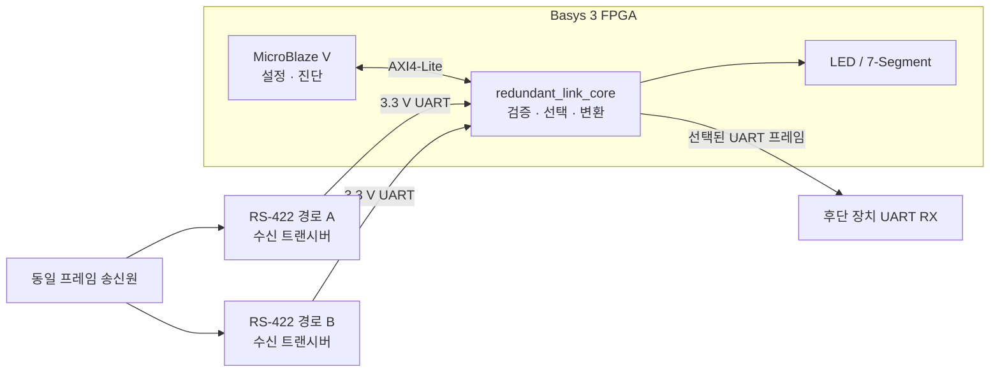

후단 출력은 차동 RS-422 드라이버가 아니라 FPGA UART TX 포트입니다. 외부 배선은 상대 장치의 논리 전압과 트랜시버 구성을 기준으로 연결합니다.

<br>

## 6. 아키텍처

### 6-1. MicroBlaze SoC Block Design

아래 이미지는 프로젝트의 `system_bd.bd`를 **Vivado IP Integrator에서 직접 내보낸 실제 Block Design**입니다. 이미지를 클릭하면 원본 크기로 확대할 수 있습니다.

[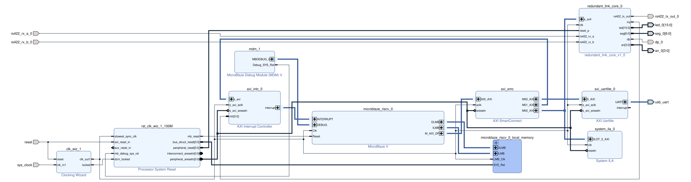](./docs/system_bd.png)

왼쪽의 Clock Wizard·Processor System Reset이 공통 클럭과 리셋을 공급하고, 가운데 MicroBlaze V가 SmartConnect를 통해 오른쪽의 통신 코어와 AXI UARTLite에 접근합니다. AXI Interrupt Controller는 코어의 IRQ를 CPU에 전달하며, System ILA는 AXI 신호를 관측합니다. 아래 논리 구성도는 같은 연결을 기능 중심으로 풀어 쓴 것입니다.

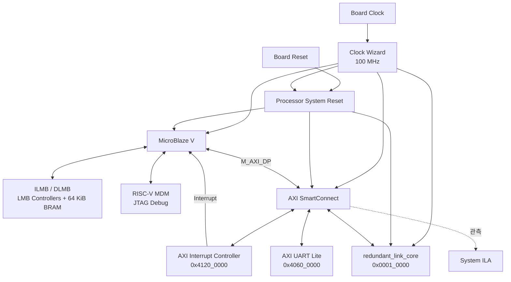

LMB memory는 instruction/data 접근에 사용하고, Custom IP·UART Lite·Interrupt Controller는 AXI 주소 공간에 배치합니다. 도식은 주요 처리 경로를 요약하며 전체 net 연결은 [system_bd.bd](./Project04_RS422Failover.srcs/sources_1/bd/system_bd/system_bd.bd)에 저장되어 있습니다.

### 6-2. 통신 코어 데이터 경로

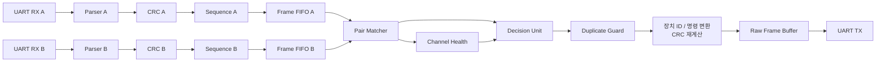

수신 경로는 채널별로 분리되어 있고, Pair Matcher 이후 출력 경로를 공유합니다. Parser의 CRC 입력 스트림과 오류 신호 등 세부 연결은 도식에서 생략했습니다.

### 6-3. 이벤트 관리 경로

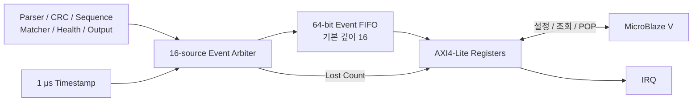

이벤트 발생과 CPU 조회 속도의 차이를 FIFO로 흡수합니다. 누락 이벤트와 잘못된 POP도 카운터로 노출하여 진단 경로 자체의 상태를 확인할 수 있습니다.

<br>

## 7. 프레임과 이벤트 데이터

### 7-1. 통신 프레임

```text
SYNC1 | SYNC2 | LEN | DEVICE_ID | CMD | SEQ | PAYLOAD | CRC_H | CRC_L
 A5   |  5A   | 1 B |    1 B    | 1 B | 1 B | 0~16 B  |  1 B  |  1 B
```

| 항목 | 규칙 |
|---|---|
| LEN | 3 + payload 길이, 허용 범위 3~19 |
| 전체 길이 | 8~24 bytes |
| CRC 범위 | LEN부터 마지막 payload까지 |
| CRC 다항식 | 0x1021 |
| CRC 초기값 | 0xFFFF |
| 비트 반전 / 최종 XOR | 없음 / 0x0000 |
| 수신 CRC 순서 | High byte → Low byte |
| 중복 식별 | 최근 이력의 DEVICE_ID + SEQ |
| 기본 중복 이력 깊이 | 4 |

### 7-2. 이벤트 레코드

| Bit | Field | 설명 |
|---|---|---|
| [63:32] | Timestamp | 1 μs 단위 시각 |
| [31:24] | Event Code | CRC, 누락, 장애 전환 등 이벤트 종류 |
| [23:22] | Channel | 00 System / 01 A / 10 B / 11 Both |
| [21:14] | Sequence | 해당 프레임 sequence |
| [13:0] | Detail | 이벤트별 상세 정보 |

주요 이벤트는 CRC/길이/UART 오류, sequence gap·duplicate·old, channel/pair timeout, data mismatch, fallback, failover, recovery, output blocked, FIFO overflow, duplicate drop입니다. 코드 값은 [redundant_link_core.v](./Project04_RS422Failover.srcs/sources_1/new/redundant_link_core.v)의 `EV_*` 상수에 정의되어 있습니다.

<br>

## 8. AXI4-Lite 인터페이스

### 8-1. SoC 메모리 맵

| 주소 범위 | 대상 |
|---|---|
| 0x0000_0000 ~ 0x0000_FFFF | 64 KiB LMB local memory |
| 0x0001_0000 ~ 0x0001_0FFF | Redundant Link Custom IP |
| 0x4060_0000 ~ 0x4060_FFFF | AXI UART Lite |
| 0x4120_0000 ~ 0x4120_FFFF | AXI Interrupt Controller |

### 8-2. Custom IP 레지스터 맵

32-bit 데이터, 4-byte 정렬, 코어 로컬 주소 폭 7-bit를 사용합니다. 아래 Offset은 Custom IP base address 기준입니다.

| Offset | 이름 | 접근 | 기능 / 기본값 |
|---|---|---|---|
| 0x00 | CONTROL | RW / W1P | Enable=0, 통계·FIFO clear pulse |
| 0x04 | STATUS | RO | alive, 선택 채널, busy, latched error |
| 0x08 | FAILOVER_CONFIG | RW | 우선 채널 A, Fail 3, Recovery 5 |
| 0x0C | PAIR_WAIT_TIMEOUT | RW | 1,000,000 cycles |
| 0x10 | CHANNEL_TIMEOUT | RW | 30,000,000 cycles |
| 0x14 | OUTPUT_DEVICE_ID | RW | 출력 ID, 기본 0 |
| 0x18 ~ 0x24 | COMMAND_MAP_0~3 | RW | 0x10 / 0x11 / 0x12 / 0x13 |
| 0x28 | IRQ_ENABLE | RW | IRQ bit mask, 기본 0 |
| 0x2C | IRQ_STATUS | RO / W1C | level 및 sticky pending |
| 0x30 | EVENT_FIFO_STATUS | RO | Empty, Full, Front Valid, Count, Underflow |
| 0x34 | EVENT_DATA_LOW | RO | Front event [31:0] |
| 0x38 | EVENT_DATA_HIGH | RO | Front event [63:32] |
| 0x3C | EVENT_FIFO_CONTROL | WO / W1P | bit 0 POP / bit 1 CLEAR |
| 0x40 | EVENT_LOST_COUNT | RO | 하위 16-bit 유실 수 |

### 8-3. AXI 처리 규칙

- AW와 W를 독립적으로 보관한 뒤 두 채널을 모두 확보하면 쓰기를 수행합니다.
- Master가 수락할 때까지 BVALID/RVALID과 응답을 유지합니다.
- 잘못된 주소, 비정렬 접근, 읽기 전용 레지스터 쓰기는 SLVERR로 응답합니다.
- Byte strobe로 갱신할 바이트를 선택합니다.
- IRQ의 W1C와 새 이벤트가 겹치면 새 이벤트가 우선합니다.
- EVENT_DATA 읽기는 POP하지 않습니다. LOW/HIGH를 읽은 뒤 명시적으로 POP합니다.

IRQ bit는 순서대로 FIFO not empty, event lost, frame mismatch, both invalid, channel fault, FIFO underflow를 나타냅니다.

<br>

## 9. 핀맵과 상태 표시

### 9-1. 통신 핀

| 외부 포트 | Basys 3 | FPGA Pin | 방향 |
|---|---|---|---|
| rs422_rx_a_0 | JA1 | J1 | A 채널 논리 입력 |
| rs422_rx_b_0 | JA2 | L2 | B 채널 논리 입력 |
| rs422_tx_out_0 | JA3 | J2 | 선택 프레임 UART 출력 |

입력에는 pull-up을 적용하고 출력은 DRIVE 8 / SLEW SLOW로 지정합니다. Clock/reset은 Board Interface 제약을 사용합니다. **RS-422 차동선을 Pmod 핀에 직접 연결하지 않고 3.3 V 논리 출력 트랜시버를 사용합니다.**

전체 핀 제약은 [basys3_redundant_link.xdc](./Project04_RS422Failover.srcs/constrs_1/new/basys3_redundant_link.xdc)에 있습니다.

### 9-2. LED / FND

| 출력 | 표시 |
|---|---|
| LED0 | System Enable일 때 heartbeat |
| LED1 | Fault, mismatch, both invalid, duplicate, event lost 종합 alert |
| LED15:2 | 0 |
| FND 비활성 | 0FF |
| FND 활성 | Mode / Last Channel / Sequence HEX 2자리 |
| Mode | d 양쪽 정상 / A A만 가능 / b B만 가능 / F 양쪽 Fault / - 대기 |
| Segment / Anode | Active-Low |

<br>

## 10. 장애 판정과 상태 전이

### 10-1. 채널별 건강 상태

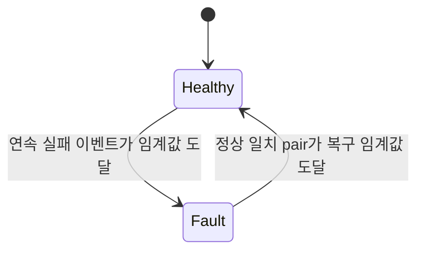

기본 임계값은 실패 3회, 복구 5회입니다. **실패 횟수의 단위는 transaction 수가 아니라 이벤트 수**입니다. 하나의 CRC 오류와 뒤따르는 pair 누락 판정은 별도 실패 사건으로 집계될 수 있습니다.

### 10-2. 출력 판정

| Matcher 결과 | 채널 상태 | Decision |
|---|---|---|
| Pair 일치 | 양쪽 사용 가능 | 우선 채널 채택 |
| Pair 일치 | 한쪽만 사용 가능 | 정상 채널 채택, degraded |
| Pair 불일치 | 무관 | mismatch drop |
| Single A/B | 해당 채널 사용 가능 | 단일 채널 채택, degraded |
| Single A/B | 해당 채널 사용 불가 | 출력 차단 |
| Pair 일치 | 양쪽 사용 불가 | both invalid |

복구는 단순 바이트 수신만으로 판정하지 않습니다. 두 경로의 일치 pair를 근거로 채널을 정상 상태로 되돌립니다.

<br>

## 11. 실행 구조와 소스 구성

### 11-1. 기본 타이밍

| 기능 | 설정 | 100 MHz 기준 |
|---|---:|---:|
| UART | 115,200 baud | 기본 직렬 통신 속도 |
| Interbyte timeout | 50,000 cycles | 500 μs |
| Frame timeout | 500,000 cycles | 5 ms |
| Pair wait | 1,000,000 cycles | 10 ms |
| Channel timeout | 30,000,000 cycles | 300 ms |
| Timestamp tick | 100 cycles | 1 μs |
| FND 자리 scan | 100,000 cycles | 자리당 1 ms, 전체 250 Hz |
| Heartbeat toggle | 50,000,000 cycles | 0.5 s |

Pair/channel timeout은 AXI에서 설정하고 Parser timeout은 RTL parameter로 지정합니다.

### 11-2. RTL 모듈

| 모듈 | 역할 |
|---|---|
| redundant_link_core | 데이터·관리 경로 통합 및 출력 변환 |
| uart_rx / uart_tx | 직렬 바이트 수신·송신 |
| frame_parser | 프레임 조립, 길이·timeout 검사 |
| crc16_ccitt | 수신 CRC 누적 계산과 검사 |
| seq_monitor | sequence gap·중복·과거 프레임 판정 |
| frame_fifo | 채널별 프레임 대기열 |
| pair_matcher | A/B 프레임 매칭, 누락·불일치 구분 |
| channel_health_mgr | 채널 실패 누적 및 복구 |
| decision_unit | 채택·폐기·degraded·선택 채널 결정 |
| duplicate_guard | 최근 출력 이력 기반 중복 제거 |
| raw_frame_buffer | UART 송신 대기열 |
| event_arbiter / event_fifo | 이벤트 중재·저장·유실 관리 |
| axi_lite_regs | 설정, 상태, 이벤트 조회, IRQ |
| status_display | LED/FND 상태 표시 |

### 11-3. 저장소 구조

```text
Project04_RS422Failover/
├── README.md
├── FIX_REPORT.md
├── docs/
│   ├── rs422_hardware.png         # 실물 구성 사진
│   └── verification/             # 실제 VCD 파형, 구현 보고서, 검증 요약
├── scripts/                      # XSim 회귀 검증, VCD 도식화, OOC 구현
├── Project04_RS422Failover.xpr
├── Project04_RS422Failover.srcs/
│   ├── sources_1/
│   │   ├── new/                   # Verilog RTL 및 Custom IP 메타데이터
│   │   └── bd/system_bd/          # MicroBlaze V Block Design
│   ├── sim_1/new/                 # Verilog 자동 판정 테스트벤치
│   └── constrs_1/new/             # Basys 3 XDC
├── redundant_link_vitis.zip       # 로컬 Vitis 프로젝트 보관본
└── stm_setting.zip                # 로컬 STM32 프로젝트 보관본
```

ZIP 보관본과 생성 산출물의 Git 포함 여부는 `.gitignore`를 따릅니다. RTL 모듈명과 IP VLNV는 설계 연결의 식별자로 유지합니다.

<br>

## 12. 핵심 설계 포인트

### 12-1. 데이터 처리와 CPU 관리 분리

UART 수신부터 최종 출력까지 RTL이 처리하고 CPU는 설정과 진단에 집중합니다. CPU의 이벤트 처리 속도가 프레임 검사 순서를 결정하지 않습니다.

### 12-2. 불일치 프레임의 명시적 차단

채널 두 개가 서로 다른 내용을 전달하면 정답을 다수결로 결정할 수 없습니다. Decision Unit은 mismatch를 기록하고 해당 pair를 폐기합니다.

### 12-3. 정상적인 backpressure와 유실 구분

송신 버퍼가 가득 차면 producer는 valid와 데이터를 유지합니다. 대기 자체를 overflow로 기록하지 않고, handshake 전에 요청이 철회되는 경우를 구분합니다.

### 12-4. 버퍼 데이터와 유효성 분리

배열 쓰기와 reset 제어를 분리하고 count/valid로 유효 구간을 관리하여 distributed RAM 추론을 지원합니다.

### 12-5. 관측 가능한 장애 처리

채널 선택뿐 아니라 CRC 오류, timeout, failover, recovery, 중복 차단과 이벤트 유실까지 기록합니다. 동일 시각에 여러 오류가 발생하는 상황도 중재 경로에서 처리합니다.

<br>

## 13. Troubleshooting

### 13-1. FIFO 대기가 overflow로 집계됨

- **문제** : 버퍼가 가득 찬 동안 유지되는 valid 요청을 유실로 간주했습니다.
- **해결** : 정상 대기와 handshake 전 요청 철회를 구분하고, producer가 ready까지 데이터를 유지하도록 정리했습니다.

### 13-2. FND가 이전 선택 채널을 표시함

- **문제** : 현재 프레임 sequence와 한 프레임 전 선택 채널이 함께 표시될 수 있었습니다.
- **해결** : 현재 전송 handshake의 선택 채널을 표시 경로에 전달했습니다.

### 13-3. Reset과 동작 clear 경로가 섞임

- **문제** : 시스템 enable과 timeout/FIFO clear를 비동기 reset 경로에 섞으면 제어 구조가 복잡해집니다.
- **해결** : 비동기 reset은 reset_p로 한정하고 동작 clear는 클럭 내부에서 처리하도록 정리했습니다.

### 13-4. 이벤트 집계가 임계 경로를 형성함

- **문제** : 여러 이벤트 소스의 유실 수 집계와 누적 연산이 타이밍에 영향을 주었습니다.
- **해결** : 균형형 popcount tree, one-hot 우선 선택, 17-bit 포화 덧셈으로 조합 경로를 정리했습니다.

세부 수정 근거와 검증 범위는 [FIX_REPORT.md](./FIX_REPORT.md)에 기록되어 있습니다.

<br>

## 14. 검증 및 성능 분석

Vivado 2024.2의 self-checking 시뮬레이션과 통신 코어의 배치·배선 결과를 함께 분석합니다. 파형은 실제 XSim VCD에서 생성하며, 자원과 timing 수치는 `redundant_link_core` 단독 **Out-of-Context(OOC)** 구현을 기준으로 합니다. MicroBlaze V·SmartConnect·ILA·local memory를 포함한 전체 SoC 수치와는 구분합니다.

### 14-1. Self-checking RTL simulation

2026-09-08 재실행 결과 : **17 / 17 PASS**. Verilog 소스를 컴파일하고 각 테스트벤치를 독립적으로 elaboration·simulation한 뒤, PASS 메시지와 FAIL/ERROR 부재를 함께 검사합니다. [전체 테스트 결과](./docs/verification/simulation_summary.txt)

| 검증 그룹 | 테스트벤치 |
|---|---|
| 직렬 입출력 | tb_uart_rx, tb_uart_tx |
| 무결성 | tb_frame_parser, tb_crc16_ccitt, tb_seq_monitor |
| 이중화 판정 | tb_pair_matcher, tb_channel_health_mgr, tb_decision_unit |
| 출력 경로 | tb_duplicate_guard, tb_raw_frame_buffer |
| 버퍼 / 이벤트 | tb_frame_fifo, tb_event_arbiter, tb_event_fifo |
| 관리 / 표시 | tb_axi_lite_regs, tb_status_display |
| 코어 통합 | tb_redundant_link_core |
| 실패 집계 정책 | tb_fail_count_per_transaction |

검증 범위는 CRC·sequence 판정, pair timeout, failover·복구, FIFO 동시 push/pop, AXI 채널 순서 및 backpressure, IRQ clear 경합, 출력 프레임 변환, FND 선택 채널 갱신을 포함합니다. 기존 [FIX_REPORT](./FIX_REPORT.md)의 16개 테스트에 실패 이벤트 집계 테스트를 포함하여 재검증했습니다.

#### 14-1-1. 주요 시뮬레이션 파형

아래는 `tb_redundant_link_core`의 **0~89,555 ns** 실행 중 주요 구간을 확대한 파형입니다. 축은 실제 시뮬레이터 시간(ns), 버스 값은 16진수입니다.

> 테스트벤치는 `always #5`로 10 ns 클럭을 만들지만, UART 분주를 줄이기 위해 `CLK_FREQ_HZ=1,000,000`, `BAUD_RATE=100,000`을 사용합니다. 따라서 파형의 UART는 10 clocks/bit, 실제 시뮬레이션 시간으로 100 ns/bit입니다. Pair timeout도 50 clocks로 줄였습니다. 이 가속 파형의 지연을 보드 기본 설정의 지연으로 읽으면 안 됩니다.

**(1) 정상 이중 수신 : 동일 프레임을 한 번만 전달**

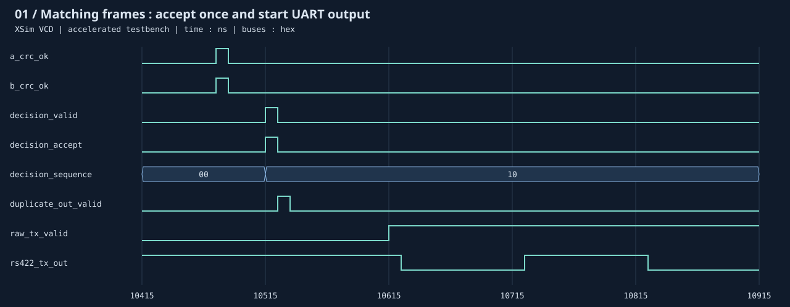

- 10,515 ns에 `decision_valid=1`, `decision_accept=1`, `decision_sequence=10`이 함께 나타납니다.
- 중복 검사와 출력 프레임 변환을 거쳐 10,625 ns에 TX start bit가 시작됩니다. 판정에서 첫 start bit까지 이 테스트에서는 **110 ns / 11 clocks**입니다.
- 입력 `A5 5A 05 01 10 10 DE AD ED EB`는 출력 `A5 5A 05 55 A0 10 DE AD 80 0E`로 비교됩니다. ID·CMD 변경과 CRC 재계산까지 10바이트 전체를 자동 검사합니다.

**(2) Payload 불일치 : 양쪽 CRC가 정상이어도 출력 차단**

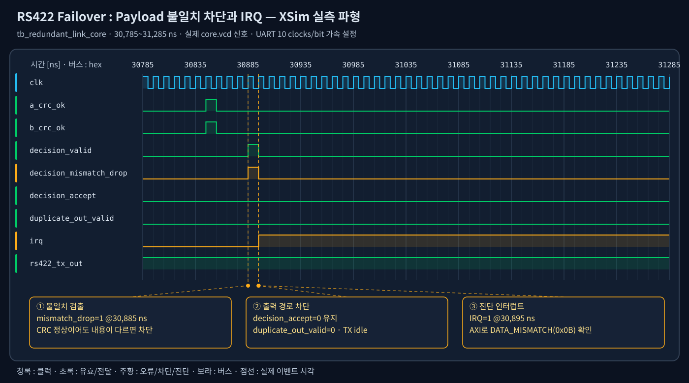

30,885 ns에 `decision_mismatch_drop=1`이 발생하지만 `decision_accept=0`이고 출력 UART는 idle을 유지합니다. 테스트벤치는 추가 출력 바이트가 없음을 검사하고, IRQ와 이벤트 코드 `0x0B(DATA_MISMATCH)`를 AXI로 읽어 확인합니다. 정상 CRC만으로 프레임 내용의 일치까지 보장되지는 않으므로 두 조건을 별도로 검사합니다.

**(3) A 채널 CRC 오류 : 정상 B 채널로 fallback**

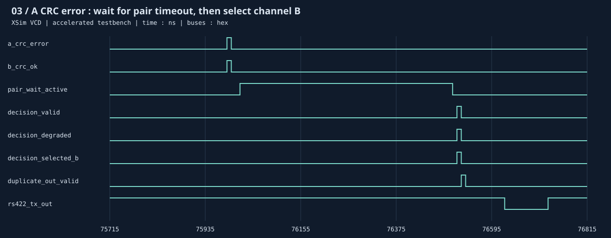

75,985 ns에 A의 CRC 오류가 검출됩니다. B 프레임은 pair 대기를 거쳐 76,515 ns에 `decision_degraded=1`, `decision_selected_b=1`로 채택됩니다. 출력의 payload `BE EF`와 재계산된 CRC `57 9A`를 검사하여, 오류 A의 payload가 섞이지 않는지 확인합니다.

**(4) 늦게 도착한 동일 프레임 : 이중 실행 방지**

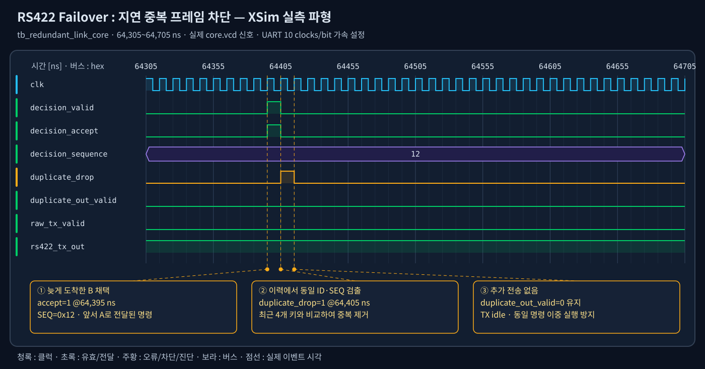

이미 A로 전달한 `SEQ=0x12`가 뒤늦게 B로 도착하면, 선택 단계는 프레임을 채택하더라도 64,405 ns에 `duplicate_drop=1`이 발생합니다. `duplicate_out_valid`는 올라오지 않고 UART 출력도 추가되지 않습니다. **채널 선택과 중복 제거가 서로 다른 단계**임을 보여주는 구간입니다.

### 14-2. Timing·자원·성능 분석

#### 14-2-1. 자원 사용률

100 MHz 제약을 적용한 코어의 route 완료 후 `Report Utilization` 결과입니다. 얕은 프레임 FIFO와 이벤트 FIFO는 분산 RAM으로 구현되므로, 이 코어의 BRAM 사용량과 CPU용 local memory 사용량은 별개입니다.

| 자원 | 사용 / 가용 | 사용률 | 비고 |
|---|---:|---:|---|
| Slice LUTs | 3,155 / 20,800 | 15.17% | 논리 2,751 + 분산 RAM 404 |
| Slice Registers (FF) | 2,933 / 41,600 | 7.05% | latch 0 |
| Block RAM Tile | 0 / 50 | 0.00% | 코어의 얕은 FIFO는 LUT RAM 사용 |
| DSP | 0 / 90 | 0.00% | 정수 카운터·비교·CRC 중심 |

코어 기준으로 LUT 약 84.8%, FF 약 93.0%가 남습니다. 전체 SoC에 추가되는 CPU·인터커넥트·디버그 IP·메모리의 비용은 이 여유분에서 별도로 고려해야 합니다. OOC의 `Bonded IOB=0`은 물리 핀이 필요 없다는 뜻이 아니라 I/O buffer를 제외한 합성 방식의 결과입니다. [자원 보고서](./docs/verification/utilization.rpt)

#### 14-2-2. Setup / Hold 타이밍

`scripts/ooc.tcl`은 **합성 전부터 10 ns 클럭 제약을 읽고**, synthesis → opt → place → phys_opt → route 순서로 구현합니다. 아래는 2026-09-08 실행 결과입니다.

| 항목 | Slack | Total negative slack | 실패 endpoint |
|---|---:|---:|---:|
| Setup | WNS **+0.204 ns** | TNS 0.000 ns | 0 / 8,350 |
| Hold | WHS **+0.028 ns** | THS 0.000 ns | 0 / 8,350 |
| Pulse Width | WPWS **+3.750 ns** | TPWS 0.000 ns | 0 / 3,737 |

제약이 적용된 코어 내부 경로는 100 MHz에서 setup·hold·pulse-width 조건을 만족합니다. Setup 여유는 목표 주기의 약 2.04%로, 충분히 큰 여유라고 단정하기보다는 통합 후 재확인이 필요한 수준으로 해석합니다. [Timing Summary](./docs/verification/timing_summary.rpt)

가장 긴 setup 경로는 `u_event_fifo/count_reg[4]`에서 `u_event_arbiter/event_lost_count_reg[5]`까지입니다. 데이터 경로 지연 9.744 ns 중 로직 3.052 ns(31.3%), 배선 6.692 ns(68.7%)이며 로직 깊이는 14단입니다. 즉 UART 직렬화 자체보다 **이벤트 FIFO 상태에서 유실 카운터로 이어지는 제어 경로**가 timing을 제한합니다. [임계 경로 보고서](./docs/verification/critical_paths.rpt)

OOC에서는 입력 58개·출력 54개에 외부 I/O delay가 적용되지 않았습니다. 이 결과는 내부 경로 검증이며, 보드 I/O와 MicroBlaze SoC 전체의 timing sign-off 또는 실물 동작 측정값으로 사용하지 않습니다. 과거 `FIX_REPORT`의 WNS +0.143 ns는 별도 실행 기록이고, 본 표는 함께 저장한 재현 스크립트의 결과입니다.

#### 14-2-3. 통신 처리량과 장애 응답 시간

다음은 **보드 기본 파라미터에서 계산한 설계 지표**입니다. 위 가속 시뮬레이션의 시간이나 실물 측정값과 구분합니다.

| 항목 | 값 | 해석 |
|---|---:|---|
| 기준 클럭 | 100 MHz / 10 ns | RTL 처리 주기 |
| UART 분주 | 868 clocks/bit | `(100,000,000 + 115,200/2) / 115,200`의 정수 결과 |
| 실제 분주 baud | 약 115,207.37 bps | 목표 115,200 대비 +0.0064% |
| UART 8-N-1 byte | 86.8 μs | start 1 + data 8 + stop 1 = 10 bits |
| 프레임 직렬화 | 694.4 μs~2.0832 ms | 총 8~24 bytes, byte 사이 대기 제외 |
| 16-byte payload 효율 | 66.7% | payload 16 / frame 24 bytes |
| 최대 payload 처리량 상한 | 약 7.68 kB/s | 24-byte 프레임을 연속 전송할 때, 추가 간격·대기 제외 |
| Pair 대기 제한 | 10 ms | 한쪽 프레임만 준비된 상태의 기본 대기 한도 |
| Channel silence 제한 | 300 ms | 무수신 채널의 alive 해제 기준 |
| 오류 / 복구 임계값 | 3 / 5 | 실패 이벤트 누적 / 정상 pair 연속 복구 |
| Event FIFO / 중복 이력 | 16 events / 4 keys | 유한 버퍼, CPU 소비 속도와 입력률 관리 필요 |

두 입력이 동일 명령의 복제본이므로 이중 채널이 출력 대역폭을 두 배로 늘리지는 않습니다. 출력은 하나의 UART이며, 수신 완료·pair 판정·CRC 변환·출력 버퍼 대기·직렬화가 전체 지연을 구성합니다. 단일 채널 fallback에는 pair 대기 시간이 추가됩니다. 위 직렬화 시간과 payload 처리량은 **프로토콜 상한**으로, 종단 간 지연이나 보장 처리량은 아닙니다.

오류 임계값은 트랜잭션 수가 아니라 **실패 이벤트 수**입니다. 예를 들어 CRC 오류와 이후 pair-missing이 같은 트랜잭션에서 각각 집계될 수 있으므로, `3 × 프레임 시간`을 고정 failover 지연으로 해석하지 않습니다.

### 14-3. 정적·구조 검증

| 확인 항목 | 결과 | 근거 |
|---|---:|---|
| 합성 latch | 0 | utilization의 Register as Latch |
| 클럭 미지정 register/latch | 0 | check_timing : no_clock |
| 미제약 내부 endpoint | 0 | unconstrained_internal_endpoints |
| 조합 / latch loop | 0 / 0 | check_timing |
| 배선 완료 | 5,373 / 5,373 nets | routable nets 기준 |
| 배선 오류 | 0 | route_status |
| DRC Error | 0 | OOC 기본 DRC 검사 |

DRC에는 OOC의 보드 전압 속성 생략(`CFGBVS-1`)과 외부 부하 생략(`RTSTAT-10`) 경고가 남습니다. 또한 OOC에서는 모든 연결 기반 DRC가 실행되는 것은 아니므로, 전체 SoC 구현 시 보드 XDC·I/O 제약과 함께 검사합니다. 경고를 숨기거나 외부 경로까지 통과한 것으로 확대 해석하지 않습니다.

### 14-4. 생성 산출물과 재현 방법

Vivado 2024.2 실행 파일이 PATH에 등록된 환경에서 저장소 루트 기준으로 실행합니다. Python 스크립트는 표준 라이브러리만 사용합니다.

```bash
RUN_DIR=$(mktemp -d /tmp/rs422-verify-XXXXXX)
python3 scripts/verify.py . "$RUN_DIR/sim"
python3 scripts/plot_waveforms.py "$RUN_DIR/sim/core.vcd" "$RUN_DIR/waveforms"
vivado -mode batch -source scripts/ooc.tcl -tclargs "$PWD" "$RUN_DIR/ooc"
```

| 산출물 | 용도 |
|---|---|
| [simulation_summary.txt](./docs/verification/simulation_summary.txt) | 17개 테스트 판정 |
| [core_simulation.txt](./docs/verification/core_simulation.txt) | 통합 테스트 원본 실행 로그 |
| [core.vcd](./docs/verification/core.vcd) | 실제 파형 원본 |
| [waveform_events.json](./docs/verification/waveform_events.json) | 도식에 사용한 판정·오류 시각 |
| [utilization.rpt](./docs/verification/utilization.rpt) | 전체 코어 자원 사용량 |
| [utilization_hierarchy.rpt](./docs/verification/utilization_hierarchy.rpt) | 모듈별 자원 분포 |
| [timing_summary.rpt](./docs/verification/timing_summary.rpt) | Setup / Hold / Pulse Width 및 제약 범위 |
| [critical_paths.rpt](./docs/verification/critical_paths.rpt) | 상위 5개 setup 경로 |
| [route_status.rpt](./docs/verification/route_status.rpt), [drc.rpt](./docs/verification/drc.rpt) | 배선 완료와 DRC 결과 |


<br>

## 15. 빌드와 소프트웨어 연동

### 15-1. Vivado 프로젝트 열기

프로젝트 루트에서 실행합니다.

```bash
vivado Project04_RS422Failover.xpr
```

프로젝트의 Block Design은 `system_bd`, 최상위는 `system_bd_wrapper`입니다. Sources 아래 RTL과 XDC를 확인하고, IP Catalog에서 `user.org:user:redundant_link_core:1.0`을 확인합니다. 필요 시 IP Repository에 `Project04_RS422Failover.srcs/sources_1/new`를 등록합니다.

### 15-2. Block Design과 구현

1. Basys 3 board definition과 Vivado 2024.2 IP를 준비합니다.
2. `system_bd`를 열어 Validate Design을 실행합니다.
3. Generate Output Products와 Create HDL Wrapper를 실행합니다.
4. Synthesis → Implementation → Generate Bitstream을 진행합니다.
5. 전체 SoC timing/DRC를 확인하고 하드웨어 플랫폼을 내보냅니다.

### 15-3. 테스트벤치 선택

Simulation Sources에서 원하는 `tb_*`를 Set as Top으로 지정하고 Run Behavioral Simulation을 실행합니다. 각 테스트의 종료 출력과 오류 로그를 확인합니다.

### 15-4. AXI 초기화 순서

1. CONTROL.SYSTEM_ENABLE=0 상태에서 설정을 준비합니다.
2. Fail/recovery 임계값과 pair/channel timeout을 설정합니다.
3. OUTPUT_DEVICE_ID와 COMMAND_MAP_0~3을 설정합니다.
4. FIFO와 pending 상태를 정리하고 필요한 IRQ를 활성화합니다.
5. CONTROL.SYSTEM_ENABLE=1로 수신 처리를 시작합니다.
6. 이벤트가 있으면 LOW/HIGH를 읽고 POP으로 다음 이벤트로 진행합니다.

리셋 기본값은 SYSTEM_ENABLE=0입니다. 데이터 경로 구동에는 CPU 또는 다른 AXI master의 enable 설정이 필요합니다.

<br>

> Project04_RS422Failover는 이중 수신 경로의 무결성 검사, 장애 판정, 출력 선택과 진단을 RTL 코어에 통합하고, MicroBlaze V와 AXI4-Lite로 운용 설정을 분리한 FPGA SoC 프로젝트입니다.
